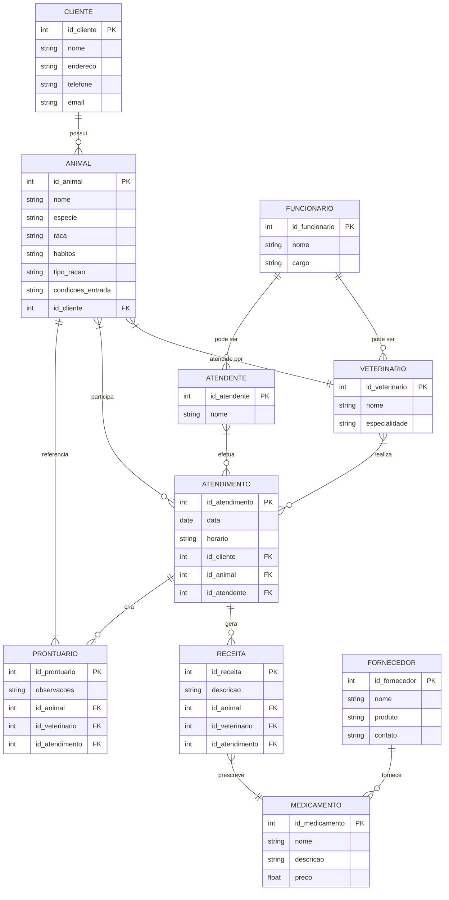
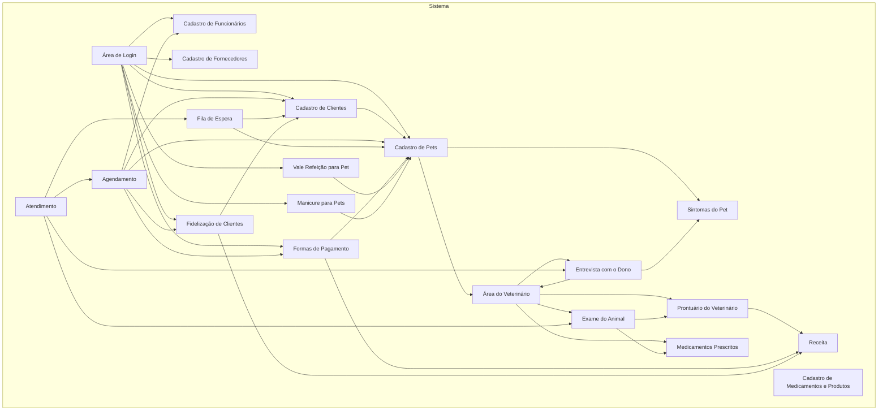
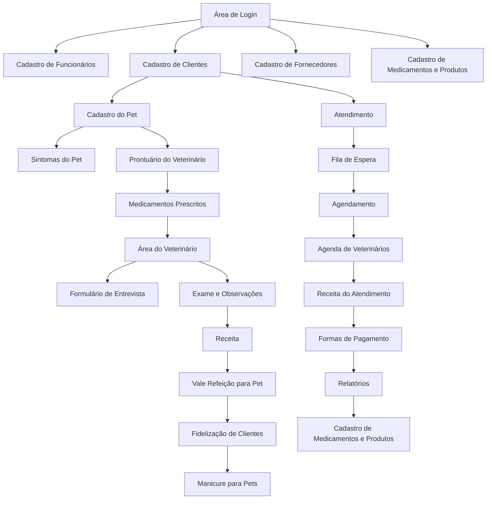

# fabio_souza
Engenharia de software 
 
Projeto  Sistema da clinica
Bicho do Mato
Autor Fabio Junior de Souza
---
# 1. Descrição do sistema 

1. Uma clínica veterinária atende apenas os animais: gatos e cachorros. 
2. Os clientes devem fazer um cadastro de si e dos animais. 
3. Os clientes devem informar as condições nas quais os animais chegam. 
4. Os clientes devem informar o tipo de ração que o animal come. 
5. O cliente deve informar hábitos do animal. 
6. Para cada animal é possível que mais de um veterinário o atenda. 
7. Os animais podem chegar e serem atendidos de acordo com uma agenda do dia. 
8. Cada animal atendido receberá uma ficha e um prontuário. 
9. Outros donos podem querer marcar horários de atendimento futuro. 
10. O atendimento gera uma receita para o animal. 
11. Quando um cliente chega na clínica veterinária ele é atendido por um atendente. 
12. O atendente deve verificar se existe agenda disponível com um veterinário. 
13. O atendente deve colocar o cliente e seu animal na fila de espera, se for o caso. 
14. O atendente deve levar o cliente e o animal até o veterinário. 
15. O veterinário deve realizar uma entrevista com o dono do animal. 
16. O resultado da entrevista deve ir para um formulário. 
17. O veterinário deverá examinar o animal e anotar em prontuário(ficha) suas observações. 
18. Dependendo da situação do animal este receberá uma receita.
20. área de login
21. cadastro de Funcionários
22. cadastro de clientes,
23. cadastro de fornecedores
24. cadastro do pet
25. sintomas do pet
26. área do veterinário 
27. Prontuário do veterinário 
28. medicamentos prescritos 
29. cadastro de medicamentos e produtos 
31. formas de pagamento(boleto
32. Atendimento 07:00 as 18:00 
33. Fidelização de Clientes 
34. Vale refeição para pet
35. Manicure para pets

---
# 2. Diagrama do banco de dados

---
# 3. Diagrama de casos de uso

---

---
# 4. Principais telas do sistemas 

---
# 5. Arquitetura do sistemas 

